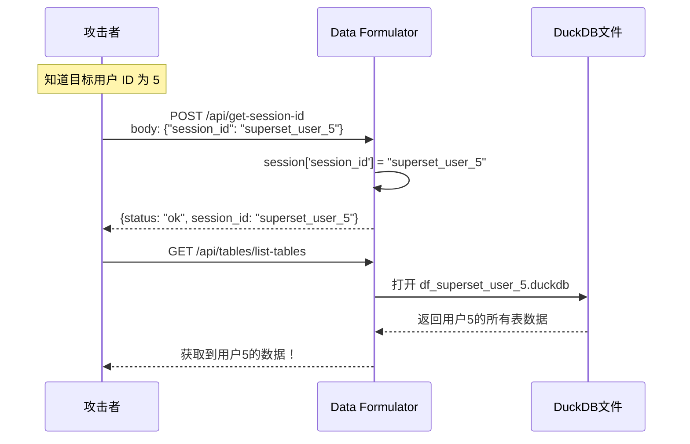
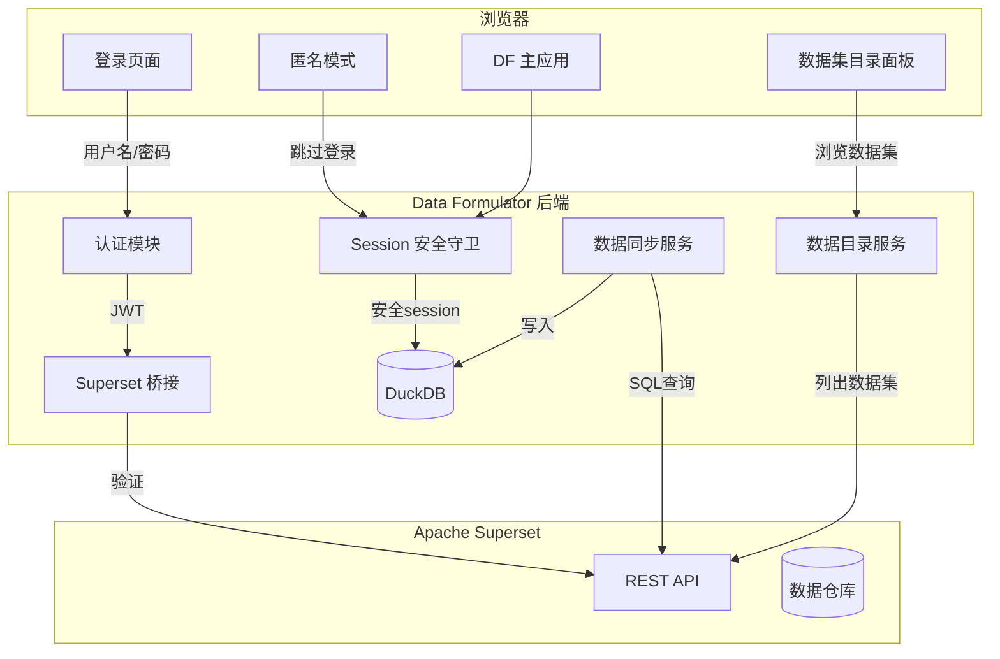

# Superset 功能集成到 Data Formulator 的可行性分析与安全评估

## 一、可行性结论：完全可行，且有明显优势

当前 `superset-df-integration` 作为独立的 Gateway 层运行，本质上是对 DF 的"包装"：认证、数据目录、数据拉取都通过 Gateway 代理。将这些功能直接集成到 DF 中可以：

- **消除 Gateway 中间层**：减少一个独立服务的部署和运维
- **降低网络延迟**：数据不再经过 Gateway 中转
- **简化架构**：一个服务取代三个（Superset + Gateway + DF）中的两个
- **原生体验**：登录和数据集浏览成为 DF 的一部分，而非外部嵌入

---

## 二、当前安全风险分析（非常重要）

### 2.1 Session ID 可被前端篡改 -- 存在严重安全漏洞

当前 DF 的 session 机制存在以下风险：

**后端漏洞（[app.py](data-formulator/py-src/data_formulator/app.py) 第 207-210 行）**：

```python
# 任何客户端都可以通过 POST body 指定任意 session_id
else:
    session['session_id'] = current_session_id  # 直接覆盖！
    session.permanent = True
```

**前端漏洞（[dfSlice.tsx](data-formulator/src/app/dfSlice.tsx) 第 359-376 行）**：

```typescript
// 前端把 Redux state 中的 sessionId 发给后端
body: JSON.stringify({
    session_id: sessionId,  // 用户可以在 DevTools 中修改
}),
```

**Gateway 的确定性 ID（[session_manager.py](superset-df-integration/gateway-service/gateway/auth/session_manager.py) 第 26-28 行）**：

```python
def get_session_id(self, superset_user_id: int) -> str:
    return f"superset_user_{superset_user_id}"  # 容易猜测！
```

### 2.2 攻击场景




**风险等级：高**。只要知道 `superset_user_{id}` 的命名规则（且 Superset 用户 ID 通常是递增整数），攻击者可以遍历所有用户的数据。

### 2.3 即使不通过 Gateway，纯 DF 也有问题

- 在**数据库禁用模式**下，session_id 完全由客户端控制（无 cookie 验证）
- 在**数据库启用模式**下，虽然用了 Flask session（cookie），但 `get-session-id` 端点允许客户端覆盖 session_id，等于绕过了 cookie 保护
- Redux state 中的 `sessionId` 可通过浏览器 DevTools 修改后再发送

---

## 三、集成方案设计

### 3.1 整体架构




### 3.2 需要从 Gateway 迁移到 DF 的模块


| Gateway 模块                    | 迁移到 DF 的位置                                       | 说明              |
| ----------------------------- | ------------------------------------------------ | --------------- |
| `auth/superset_bridge.py`     | `py-src/data_formulator/auth/superset_bridge.py` | Superset JWT 认证 |
| `auth/session_manager.py`     | 重构融入 DF 现有 session 机制                            | 不再用确定性 ID       |
| `bridge/superset_client.py`   | `py-src/data_formulator/superset/client.py`      | Superset API 封装 |
| `catalog/superset_catalog.py` | `py-src/data_formulator/superset/catalog.py`     | 数据集目录 + 缓存      |
| `routes/data_routes.py`       | 扩展 `tables_routes.py` 或新建 Blueprint              | 数据加载            |
| `routes/auth_routes.py`       | 新建 `py-src/data_formulator/auth_routes.py`       | 认证路由            |
| `LoginView.tsx`               | `src/views/LoginView.tsx`                        | 登录页面            |
| `CatalogView.tsx`             | `src/components/SupersetCatalog.tsx`             | 数据目录面板          |


### 3.3 前端路由改造

当前 DF 路由很简单（`/` 和 `/about`），需扩展为：

```
/login          -> LoginView（Superset 账号登录 / 选择匿名）
/               -> DataFormulatorFC（主应用，需已登录或匿名）
/about          -> About 页面
```

### 3.4 双模式设计（登录 vs 匿名）

- **Superset 登录模式**：
  - 通过 Superset REST API 验证用户名/密码
  - JWT 存储在后端 Flask session（HttpOnly cookie）
  - 可浏览和加载 Superset 数据集
  - Session ID 由后端生成（安全随机 + 绑定用户），不可被前端覆盖
- **匿名模式**：
  - 跳过登录，后端生成随机 session ID
  - 只能上传本地数据集
  - 无法访问 Superset 数据集目录

---

## 四、安全修复方案

### 4.1 核心原则：Session ID 永远不能由前端指定

**后端改造（[app.py](data-formulator/py-src/data_formulator/app.py)）**：

```python
@app.route('/api/get-session-id', methods=['GET', 'POST'])
def get_session_id():
    # 永远不接受客户端传入的 session_id
    if 'session_id' not in session:
        session['session_id'] = secrets.token_hex(16)
        session.permanent = True
    return jsonify({"status": "ok", "session_id": session['session_id']})
```

**前端改造（[dfSlice.tsx](data-formulator/src/app/dfSlice.tsx)）**：

```typescript
export const getSessionId = createAsyncThunk(
    "dataFormulatorSlice/getSessionId",
    async () => {
        // 不再发送 session_id，完全由后端控制
        const response = await fetch(getUrls().GET_SESSION_ID, {
            method: 'POST',
            credentials: 'include',
        });
        return response.json();
    }
);
```

### 4.2 用户与 Session 绑定

- 登录用户：`session['session_id']` 由后端在认证成功时生成，格式为 `secrets.token_hex(16)`，同时在 session 中记录 `superset_user_id` 用于权限检查
- 匿名用户：`session['session_id']` 由后端随机生成，不与任何用户绑定
- **关键**：同一个 Superset 用户再次登录时，后端通过查找 `superset_user_id` 映射到已有的 session_id，而不是用确定性 ID

### 4.3 数据库文件命名

```python
# 之前（不安全）：文件名包含可猜测的 user_id
db_file = f"df_superset_user_{user_id}.duckdb"

# 之后（安全）：文件名使用随机 token
db_file = f"df_{random_session_id}.duckdb"
# 映射关系存储在服务端：user_id -> random_session_id
```

### 4.4 完整安全措施清单

- 移除前端指定 session_id 的能力
- Flask session 使用强随机 `SECRET_KEY`
- Cookie 设置 `HttpOnly`、`SameSite=Lax`、生产环境 `Secure`
- Superset JWT 只存后端 session，不暴露给前端
- 添加 API 路由中间件：所有 `/api/tables/*` 和 `/api/agent/*` 请求需验证 session 有效性
- 用户间数据完全隔离，session_id 不可预测

---

## 五、实施路径建议

分两阶段实施：

**阶段 1：安全修复（优先级最高）**

- 修复 session ID 覆盖漏洞
- 移除前端指定 session_id 的能力
- 添加 session 验证中间件

**阶段 2：功能集成**

- 后端：添加 Superset 认证和数据桥接模块
- 前端：添加登录页面和数据目录面板
- 测试：端到端验证登录、数据同步、匿名模式

---

## 六、工作量评估


| 模块               | 估计工作量        | 复杂度 |
| ---------------- | ------------ | --- |
| 安全修复（session）    | 0.5-1 天      | 低   |
| 后端认证模块           | 1-2 天        | 中   |
| 后端 Superset 数据桥接 | 2-3 天        | 中高  |
| 前端登录页面           | 1 天          | 低   |
| 前端数据目录面板         | 1-2 天        | 中   |
| 双模式（登录/匿名）逻辑     | 1 天          | 中   |
| 集成测试             | 1-2 天        | 中   |
| **总计**           | **约 7-12 天** | -   |


